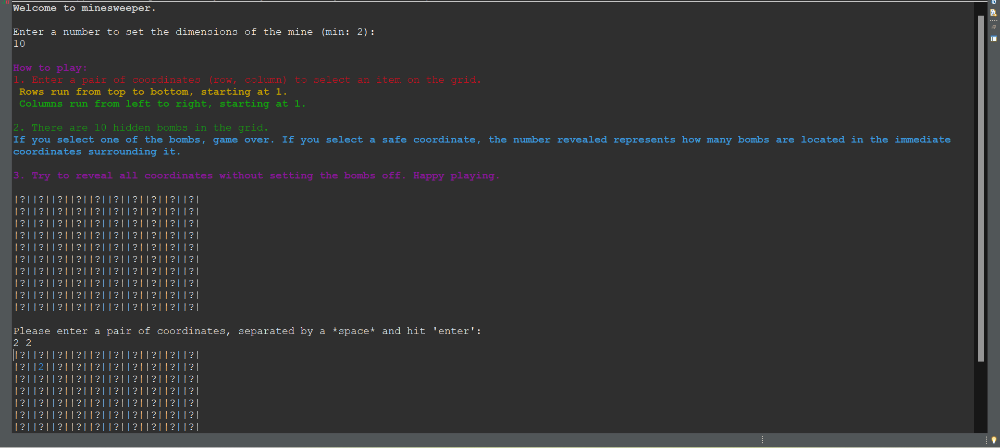

# Minesweeper Project

## Demo & Snippets

## Requirements / Purpose

-   The MVP was to create a simplified version of the game Minesweeper to be played through a CLI. This is my first project created in Java.
-   The purpose of project was to consolidate my learning of Java fundamentals and to research and develop an understanding of 2D array structures.
-   The stack used is Java, as per the MVP, in order to further develop OOP skills/approach to programming.

## Build Steps

-   Pull the project from main branch, open in any code editor (e.g. Eclipse, VS Code), run application in Main class.

## Design Goals / Approach

-   My first approach was to use 2D arrays to create and store my minesweeper grid and bomb location data. However, after realising that Java Array methods were unable to perform the operations I wanted, I converted them to 2D array lists in order to access Java ArrayList methods.
-   I have tried to take an OOP apprach to the project, and through separation of concerns have created 3 classes (along with main class): bomb class, grid class, user input class.

## Known issues

-   Error handling for input mismatch when taking in 2 user inputs.
    -   If the user enters a 'number + Nan' entry and then a 'Nan + number' entry, both numbers will be set and used as the user input and the grid is printed even though both are invalid user inputs.
    -   index out of bounds exception if one non vaild user input contains index out of bounds.

## Future Goals

-   Write tests for functions
-   Create cascade function
-   Recieved feeback for project on 10/5/23:
    -   add play again function to game
    -   make each element of the grid different colours, for better readability.
    -   remove extension of UserInput class to Grid class, as not parent-child relationship
    -   rename Bomb to Bombs class to better reflect bombs object.

---

## Change logs

### 30/04/23

-   Created Main, Bomb, Grid classes
-   Method to create 2D Array of random integers/bomb coordinates.
-   Method to check for duplicates in random integer array
-   Method to create 2D ArrayList grid

## 01/05/23

-   Create rough game play in main class.
-   Method to create 2d ArrayList of surrounding coordinates.
-   Method to check if user input is a bomb location.

### 02/05/23

-   Attempted function to convert between 2D Arrays and 2D ArrayLists, unsuccessfull.
-   Duplicates function not picking up duplicates.

### 04/05/23

-   Rewrote all 2D Arrays as 2D ArrayLists.
-   Made getSurroundingCoordinates function operational.
-   Made duplicates function operational.
-   Made is bomb function operational.
-   Create function for all bombs found.

### 06/05/23

-   Moved all functions in Main class into respective grid and bomb classes.
-   Created separate printGrid function for reusability.
-   Created separate surroudingCoordinates and checkForSurroundingBombs function to allow for reusability when completing cascading function.
-   Error handling for out of range user input and for mismatch input exceptions.

### 07/05/23

-   Formatted grid displayed to user.
-   First attempt at trying to refactor grid and bomb classes, not successful.

### 08/05/23

-   Created UserInput class to store user input, accessed with get and set methods. Extended UserInput class into Grid class so methods could access user input variable.
-   Refactored Grid class to store bombLocations as a variable, instead of a parameter in most functions.
-   Attempted to complete error handling for input mismatchs when asking for user input for grid dimensions and coordinates, however still ongoing. See known issues.
-   Updated README.

### 14/05/23

-   Change Bomb to Bombs class to better reflect Bombs object.
-   Update build steps.
-   Remove Grid class extends UserInput class, add back int[] userInput as parameter to Grid methods as required.

### 17/05/23

-   Add colour feature to grid elements and instructions.

---

## What did you struggle with?

1. As per the known issues above, I am still unable to successfully handle errors for a user input mismatch for 2 user inputs, inside a while loop and together with checking value is within range.
2. Prior to commencing the project I did not have a good understanding of what methods were available to Arrays and ArrayLists. I initially stored some variables as 2D Arrays and some as 2D ArrayLists and was not able to easily convert from one type to another to use as a parameter in my functions. I concluded it would be much easier to stick to one type. Knowing that ArrayList methods were much more comprehensive than Array methods, I rewrote all my 2D Arrays to be 2D ArrayLists.
3. As this was my first Java project, upon commencing I still did not have a good understanding of object oriented programming and separation of concerns. I first created a working version of minesweeper with just 2 classes (Bomb class, Grid class) along with the Main class.
    - After reviewing my Bomb class methods, I noticed that most methods were taking the bombLocation 2D ArrayList as a parameter so I realised I needed to create a bombLocation variable in my Bomb class.
    - After reviewing my Grid class, I noticed most methods were taking a user input variable, which was being stored in Main class. I realised that storing my userinput in the main class was not a good separation of concerns and I also didn't have methods to update or retrieve the user input from the Grid class, so I created a UserInput class and extended it to the Grid class.
